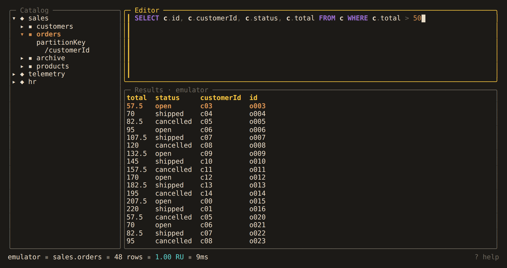

# Alchemist

A keyboard-driven terminal IDE for Azure Cosmos DB (NoSQL API), inspired by
[harlequin](https://github.com/tconbeer/harlequin): browse databases and containers,
write SQL, and page through results without leaving the terminal.



<!-- TODO: record docs/demo.tape with `vhs docs/demo.tape` and embed docs/demo.gif here -->

> **Status: early development.** Everything below works today. Release builds are
> still to come.

**[Read the documentation →](docs/README.md)**

## Features

**Query.** Every query shows its request charge (RU), runs cross-partition by default,
and pages with continuation tokens rather than loading a whole result set. The editor
[highlights, flags mistakes, and autocompletes](docs/using/editor.md) databases,
containers, functions and the fields it has seen.

**Across containers.** Cosmos DB SQL reads one container per query. Alchemist
[simulates the rest client-side](docs/language/cross-container.md): unions, inner,
outer and cross joins, `APPLY` over arrays, and CTEs, with every refused shape named
before it runs.

**Write, carefully.** [Transactional batches](docs/language/transactions.md),
[updates by query](docs/language/update.md) and
[deletes by query](docs/language/delete.md) are reviewed and confirmed before anything
is sent. Accounts other than a local emulator are
[read-only](docs/data/profiles.md#104-read-only-accounts) until you say otherwise.

**Manage.** [Create, delete and resize](docs/data/catalog.md) databases and
containers, inspect their metadata, [clone](docs/data/cloning.md) them into any
account, and keep [snapshots](docs/data/snapshots.md) on disk that diff against each
other or the live container.

**Keep.** [Export](docs/using/results.md#42-exporting-a-result-set) result sets to JSON
or CSV, search the [history](docs/using/history.md) of every query, save the ones worth
keeping, and switch between [several accounts](docs/data/profiles.md) in one session.

## Quick start

There are no release builds yet, so build from source with Go 1.26 or newer:

```sh
git clone https://github.com/colbytimm/Alchemist.git
cd Alchemist
make build
./bin/alchemist --adapter mock   # fixture data, no account needed
./bin/alchemist                  # the connect form, for a real account
```

`tab` moves between the catalog, the editor and the results, `ctrl+r` runs the query,
and `?` lists every binding. [Getting Started](docs/tutorial/getting-started.md) walks
through connecting an account and the local emulator.

## Documentation

The [manual](docs/README.md) is organized in six parts:

| Part | Covers |
|---|---|
| I. [Tutorial](docs/tutorial/getting-started.md) | building, connecting, the emulator, a tour of the workspace |
| II. [Working in the Editor](docs/using/editor.md) | highlighting, diagnostics, autocomplete, results, export, history, saved queries |
| III. [The Query Language](docs/language/cross-container.md) | cross-container queries, transactional batches, updates and deletes by query |
| IV. [Accounts and Data](docs/data/profiles.md) | profiles and keys, read-only accounts, catalog management, cloning, snapshots |
| V. Reference | [key bindings](docs/reference/keys.md), [statements](docs/reference/statements.md), [command-line programs](docs/reference/cli.md), [configuration](docs/reference/configuration.md) |
| VI. [Development](docs/development/building.md) | writing an adapter, building, testing, CI and releases |

## Development

```sh
make all    # fmt-check, lint, spell, test, build
make help   # list all targets
```

See [Building and Testing](docs/development/building.md) for the benchmark gate, CI
and releases, and [Writing an Adapter](docs/development/adapters.md) for the
architecture's one extension point.
