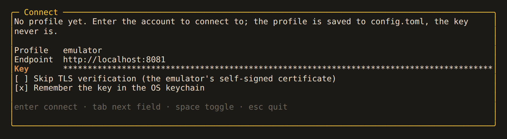
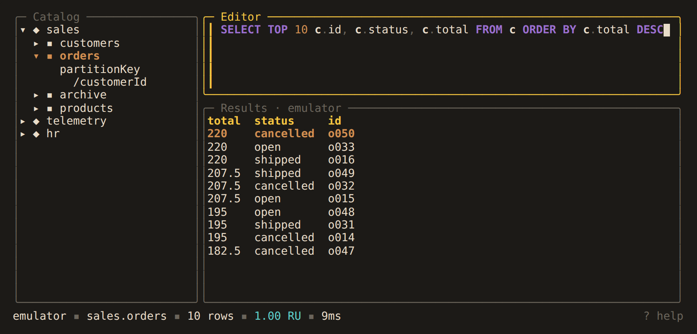

# Alchemist

A keyboard-driven terminal IDE for Azure Cosmos DB (NoSQL API). Browse databases,
write SQL, and page through results in one screen.


<!-- TODO: record docs/demo.tape with `vhs docs/demo.tape` and embed docs/demo.gif here -->

Alchemist is in early development. There are no release builds yet.

## Features

- Request charge (RU) for every query, cross-partition queries by default, and paging
  with continuation tokens.
- An editor with error hints, and autocomplete for databases, containers, functions
  and fields.
- Joins and unions across containers, run on the client.
- Transactional batches, and `UPDATE` and `DELETE` by query, each reviewed before
  anything is written.
- Create, delete and resize databases and containers, and clone them between accounts.
- Snapshots of a container on disk, with diffs between them.
- Query history, saved queries, and export to JSON or CSV.
- Several accounts in one session. Accounts are read-only unless you allow writes.

## Quick start

Build from source with Go 1.26 or newer:

```sh
git clone https://github.com/colbytimm/Alchemist.git
cd Alchemist
make build
```

Try it without an account. The mock adapter serves fixture data:

```sh
./bin/alchemist --adapter mock
```

### Connect to an account

Run `./bin/alchemist`. The first run asks for a profile name, the account endpoint and
the key:



The profile is saved to `~/.config/alchemist/config.toml`. The key goes to the OS
keychain if you tick the box, and is never written to the file. Next time,
`alchemist` connects to the default profile and `alchemist <profile>` to any other.

### Use the local emulator

`make emulator-up` starts the Cosmos DB emulator in Docker on port 8081, and
`make emulator-seed` loads it with sample `sales`, `telemetry` and `hr` databases. Use
the emulator's [well-known key](https://learn.microsoft.com/azure/cosmos-db/emulator#authentication)
when asked:

```sh
make emulator-up
make emulator-seed
./bin/alchemist profile add emulator --endpoint http://localhost:8081
./bin/alchemist emulator
```

The emulator is local, so its profile allows writes.

### Run a query

Expand `sales` in the catalog, select `orders`, press `e` and type a query. `ctrl+r`
runs it:



The status bar shows the row count and the request charge. `m` fetches the next page
when there is one, and `enter` on a row opens the document. `tab` moves between
panes, `?` lists every key, and `q` quits.

A query can also name its container, whatever is selected:

```sql
SELECT o.id, o.total FROM sales.orders o WHERE o.status = "open"
```

## Documentation

| Section | Covers |
|---|---|
| [Working in the editor](docs/README.md#working-in-the-editor) | error hints, autocomplete, results, export, history, saved queries |
| [The query language](docs/README.md#the-query-language) | joins across containers, batches, updates and deletes by query |
| [Accounts and data](docs/README.md#accounts-and-data) | profiles, read-only accounts, catalog management, cloning, snapshots |
| [Reference](docs/README.md#reference) | keys, statements, commands, configuration |

## Credits

Alchemist is inspired by [harlequin](https://github.com/tconbeer/harlequin), the SQL
IDE for the terminal.

## License

[MIT](LICENSE)
