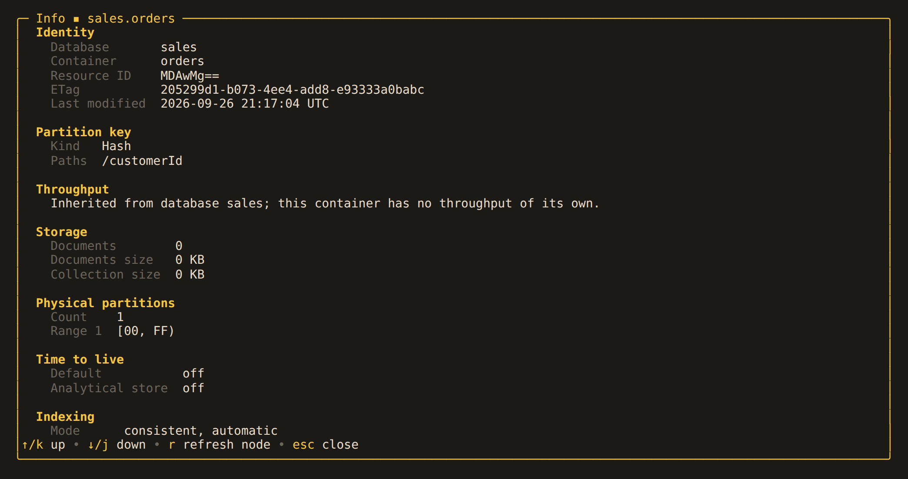

# 11. Managing the Catalog

- [11.1. Creating and deleting](#111-creating-and-deleting)
- [11.2. Throughput](#112-throughput)
- [11.3. Inspecting a node](#113-inspecting-a-node)

Cosmos DB has no DDL, so `CREATE` and `DROP` never reach the editor however good it
gets. Keys in the catalog pane do that work instead. A backend that cannot manage its
catalog, or a session that must not (a
[read-only account](profiles.md#104-read-only-accounts)), simply does not offer them,
and they disappear from the help overlay too.

## 11.1. Creating and deleting

- `n` creates a database, with optional shared throughput its containers draw on.
- `c` creates a container in the database under the cursor, taking a partition key of
  up to three comma-separated paths (`/tenantId, /customerId` is hierarchical).
- `d` deletes the database or container under the cursor.

Nothing is destroyed by a single keystroke: a delete asks for the name back, character
for character, the way the portal does. Cosmos has no undo and no recycle bin.

Renaming is absent because Cosmos cannot rename a database or a container — the ID is
the resource identity. [Cloning](cloning.md) under a new name, then deleting the
original, is the nearest thing.

## 11.2. Throughput

`t` reads the provisioned throughput of the database or container under the cursor
and replaces it, manual or autoscale. A container that draws on its database's
throughput is changed on the database, and the dialog says so rather than sending a
request Cosmos would refuse.

Minimum RU/s, autoscale step size, and which modes an account may use vary by account
type, so Alchemist sends the request and shows the service's own answer rather than
guessing the rules. A refused create leaves the dialog open with that answer under the
fields, so a rejected name is one edit away from a retry.

## 11.3. Inspecting a node

`i` on a database or container opens a read-only overlay with everything the account
serves about it:

- identity and last-modified time;
- partition key kind and paths;
- throughput mode with its floor, and whether a change is still scaling;
- document count and storage size, and physical partition ranges;
- time to live and the indexing policy;
- unique key, conflict resolution, vector and full-text policies.

A figure the account declines to serve — a container drawing on its database's
throughput has no offer of its own — keeps its heading with a line saying why. The
overlay scrolls, `r` reads the node again, and `esc` or `i` closes it. A node already
read reopens without a request.

---

[← 10. Profiles and Accounts](profiles.md) · [Contents](../README.md) · [12. Cloning →](cloning.md)
