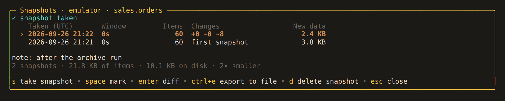
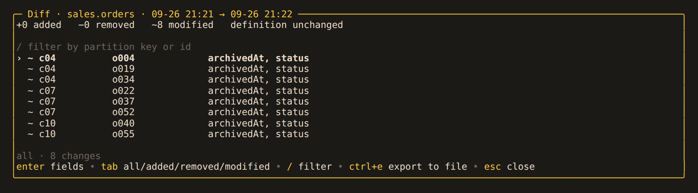
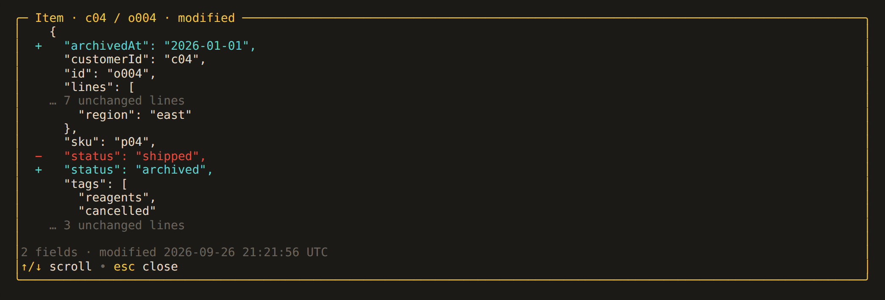

# Snapshots

A snapshot is a copy of a container's items and settings, stored on disk. Compare two
snapshots to see what changed.

## In the app

`s` on a container in the catalog takes a snapshot. `v` lists its snapshots:



`enter` compares the selected snapshot with the one before it. To compare any two,
mark them with `space` first. The diff lists added, removed and modified items, and
changes to settings such as indexing, TTL and throughput:



`enter` on an item shows its changes field by field:



On a database, `s` and `v` work on every container in it.

| Key | Where | Action |
|---|---|---|
| `s` | snapshots | take snapshot |
| `enter` | snapshots, note prompt | take |
| `space` | snapshots | mark |
| `enter` | snapshots | diff |
| `d`, then `enter` | snapshots | delete snapshot |
| `x` | snapshots, capturing | cancel capture |
| `ctrl+e` | snapshots | export items (`.jsonl` or `.json`) |
| `enter` | diff | fields |
| `tab` | diff | all/added/removed/modified |
| `ctrl+e` | diff | export (`.json` with a JSON Patch per item, or `.csv`) |

## From the command line

```sh
alchemist snapshot take prod sales.orders --note "before the migration"
alchemist snapshot diff prod sales.orders          # previous → latest
alchemist snapshot diff prod sales.orders --live   # latest → now
alchemist snapshot list prod
alchemist snapshot export prod sales.orders latest -o orders.jsonl
alchemist snapshot verify prod sales --deep
```

Snapshots are never pruned automatically. For a nightly snapshot with pruning:

```
0 6 * * *  alchemist snapshot take prod sales --note nightly \
           && alchemist snapshot prune prod sales --keep-last 7 --keep-daily 30
```

See [commands](../reference/cli.md#alchemist-snapshot) for every option.

## Consistency

A snapshot records each item as it was read during the capture, not the container at
one point in time. Items written during the capture may or may not be included. The
next snapshot picks them up. For a consistent point-in-time copy, use the account's
continuous backup.

## Cost and storage

The first snapshot reads every item. Later snapshots read each item's key and version,
and only the full body of items that changed. An unchanged container costs one read of
its keys and under 4 KB of disk.

Unchanged items are stored once, compressed. Thirty daily snapshots of a container
where 1% changes each day take about 1.4 times the space of one. `v` and
`snapshot list` show the actual size.

Snapshots are stored in `~/.local/share/alchemist/snapshots`, by profile, database and
container. Set `snapshot_dir` in `config.toml` or pass `--snapshot-dir` to move them.
Files are readable only by you (`0600`). Snapshots are not encrypted.

## Background captures

Snapshots only read, so they work on read-only accounts. A capture runs in the
background: `esc` hides it, the status bar shows its progress, `v` shows it again,
and `x` cancels it. One background job runs at a time. Containers with more than
`snapshot_max_items` items (5,000,000 by default) are refused.

`alchemist profile remove` keeps a profile's snapshots unless you pass `--purge`.
