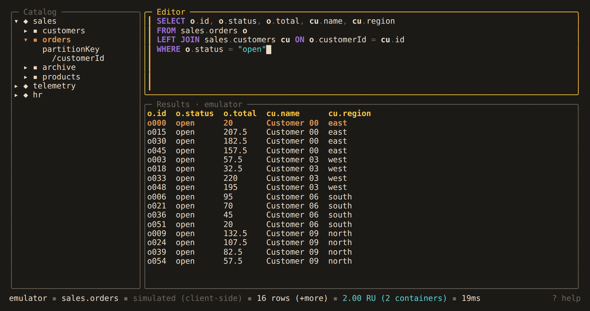

# Queries across containers

A Cosmos DB query reads one container. Alchemist also accepts queries over several
containers. It runs one query per container and merges the results on the client.
The status bar marks these results `simulated (client-side)` and shows the total RU,
split by container.



Cosmos DB's own `JOIN t IN c.array` still runs on the service, unchanged.

## Unions

List the containers after `FROM`. The same query runs on each, and a `_container`
column shows where each row came from. One alias covers the list:

```sql
SELECT * FROM sales.orders, sales.archive AS c WHERE c.status = "open"
```

## Joins

Each `JOIN` adds a container. Its `ON` is one equality between a field of the new
container and a field of any earlier one:

```sql
SELECT o.id, cu.name, p.name AS product
FROM sales.orders o
JOIN sales.customers cu ON o.customerId = cu.id
JOIN sales.products p ON o.sku = p.id
WHERE cu.region = "west"
```

- `AND` conditions after the equality may read only the new container. They filter
  it before the join: `ON o.customerId = cu.id AND cu.vip = true`.
- The same container can appear twice under different aliases.
- Columns are prefixed with their alias (`o.total`) unless renamed with `AS`.
- The select list is `*` or `alias.field` items. `ON` fields may be nested
  (`o.customer.id`). For computed columns, use a [CTE](#ctes).
- Each `WHERE` condition must read one container only. It is sent to that container.
- A container without an alias is referred to by its name.

## Join types

`JOIN` and `INNER JOIN`, `LEFT`, `RIGHT` and `FULL [OUTER] JOIN`, and `CROSS JOIN`
are supported.

```sql
SELECT o.id, o.total, cu.name
FROM sales.orders o
LEFT JOIN sales.customers cu ON o.customerId = cu.id
WHERE o.status = "open"
```

A row with no match is padded: the other side's cells are empty, and the row's JSON
leaves that side out (`{"o":{…}}`). This lets an export tell a missing customer from
a stored `null`.

A `WHERE` condition on the padded side of an outer join is refused, because it would
remove the padded rows. Put it in `ON` instead, or use `INNER JOIN`. The exception is
`NOT IS_DEFINED`, which keeps only the unmatched rows:

```sql
SELECT o.id FROM sales.orders o
LEFT JOIN sales.customers cu ON o.customerId = cu.id
WHERE NOT IS_DEFINED(cu)
```

Joins that include an outer join run in the order written and stream the first
container, so put the largest container first. A `FULL JOIN` returns its unmatched
rows last, on their own page.

`CROSS JOIN` pairs every row of one container with every row of another. It must be
the only join in the query, takes no `ON`, and each `WHERE` condition reads one side.
Both sides are read in full first, and the product counts against `max_join_rows`.
`FROM a o, b cu` with two aliases is refused; write `CROSS JOIN`.

## APPLY

`CROSS APPLY alias IN path` expands an array of each item, like Cosmos DB's
`JOIN alias IN path`. `OUTER APPLY` also keeps items whose array is missing or empty:

```sql
SELECT o.id, l.sku, l.quantity
FROM sales.orders o
OUTER APPLY l IN o.lines
```

On a single container, a query whose only extra syntax is `CROSS APPLY` is sent to the
service as `JOIN … IN`. Anything else with `APPLY` is expanded on the client at no
extra RU. Object elements become columns (`l.sku`). A scalar element is one column
named by its alias.

A join can read the expanded elements:

```sql
SELECT o.id, l.quantity, p.name
FROM sales.orders o CROSS APPLY l IN o.lines
JOIN sales.products p ON l.sku = p.id
```

`WHERE` conditions on an `APPLY` alias are refused, except `NOT IS_DEFINED(l)` after
`OUTER APPLY`. Filter elements in a CTE instead. `APPLY` over a subquery is refused.

## CTEs

`WITH name AS (query)` defines a query that the main query reads like a container.
A CTE over one container runs on the service, so it can project, filter and compute
before the join. On wide documents this saves the most RU.

```sql
WITH west AS (SELECT cu.id, cu.name FROM sales.customers cu WHERE cu.region = "west"),
     big  AS (SELECT o.id, o.customerId, ROUND(o.total) AS total
              FROM sales.orders o WHERE o.total > 100)
SELECT big.id, big.total, west.name
FROM big JOIN west ON big.customerId = west.id
```

- Inside a CTE, everything the service supports works, including `TOP`, `ORDER BY`,
  `GROUP BY` and aggregates.
- A CTE's columns are the names its select list produces. Reading any other column is
  an error.
- The RU breakdown lists each CTE by name: `west (sales.customers) 3.10`.
- `SELECT * FROM name` alone runs the CTE's query directly.
- A CTE read twice runs once and is kept in memory.
- A CTE can read earlier CTEs, and can itself be a union, a join or an `APPLY`.
- `WITH RECURSIVE` is not supported. A CTE that returns `SELECT VALUE` cannot be
  joined. Filter a CTE inside its definition, not in the main `WHERE`.

## Limits

Joins keep all but one side in memory, up to `max_join_rows` rows in total (10,000 by
default, set on the [profile](../reference/configuration.md#profile-settings)). The
limit also covers in-memory CTEs and cross joins. Past it, the query stops with an
error naming the side that went over.

In a join with no outer join, the side that streams is the first container without a
`WHERE` condition, or the `FROM` container if every side is filtered.

A merged page holds up to 1,000 rows. `m` fetches the rest.

## Not supported

These are refused before anything runs, with a suggestion where there is one:

- `ON` conditions other than one equality plus `AND` filters, and `OR` in `ON`
- `WHERE` conditions that read more than one container
- `JOIN t IN` next to a container join (use `CROSS APPLY`)
- a container list combined with a join
- `NATURAL JOIN` and `USING`
- `ORDER BY`, `GROUP BY`, `OFFSET` and `TOP` on a client-side query (put them in a CTE)
- subqueries over another container or a CTE
