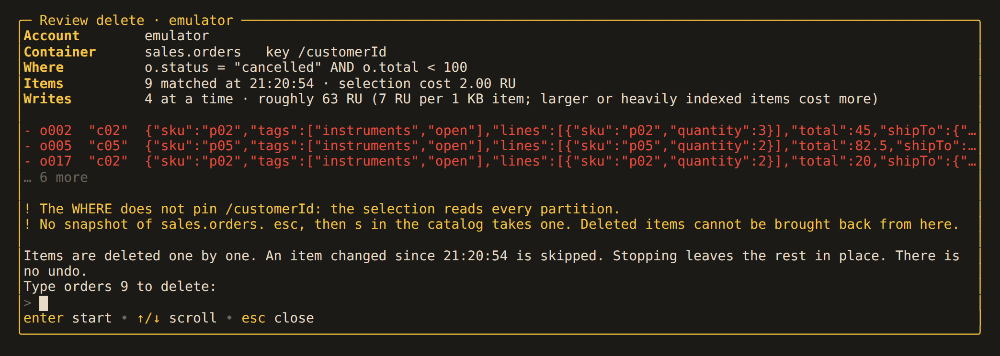

# Deleting by query

`DELETE` works like [`UPDATE`](update.md): a query finds the matching items, then
Alchemist deletes each one.

```sql
DELETE FROM sales.orders o WHERE o.status = "cancelled"
```

## Syntax

`DELETE FROM database.container [[AS] alias] WHERE condition`

`WHERE` is required. Write `WHERE true` to delete every item.

These are refused, with the reason: `DELETE` without `FROM`, a field before `FROM`
(use `UPDATE … UNSET`), a second container, `TOP`, `ORDER BY`, `OFFSET`, `LIMIT`,
`RETURNING`, and anything after `;`. `TRUNCATE` is not supported.

To delete items chosen by another container, run that query first, then
`DELETE … WHERE o.id IN (…)`.

## Changed items are kept

Each delete is sent with the ETag read during the review. An item that anyone changed
since then is `skipped: changed`, even if it still matches. An item already gone is
`skipped: gone` and does not count as a failure.

## Review



The review lists the first items, an estimated cost (about 7 RU per 1 KB item), and
the same warnings as an update. To start, type the container name and the item count,
as in `orders 20`.

Everything else matches updates: `ctrl+r` never deletes, recalled statements are
reviewed again, and the job, its keys and its report are the same. Running the
statement again finishes a stopped run.

Alchemist keeps no copy of deleted items. Before a large delete, take a
[snapshot](../data/snapshots.md), whose `.jsonl` export can restore the items, or a
[clone](../data/cloning.md). Accounts with continuous backup can also restore to a
point in time.

## Alternatives

- To delete every item, deleting and recreating the container (`d`, then `c`)
  costs no RU per item. You will need to set its throughput and indexing again.
- To remove items after an age, set a time to live on the container or on each item
  (`ttl`). The service deletes expired items in the background. For existing items,
  `UPDATE … SET o.ttl = 86400 WHERE …`.
- To delete a few known items atomically in one partition, use a
  [batch](transactions.md) with `DELETE "id" IF MATCH "…"`.
- Delete by partition key is a preview feature the Go SDK does not support.
