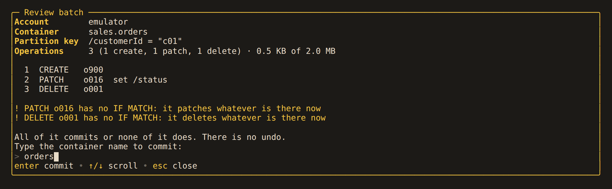
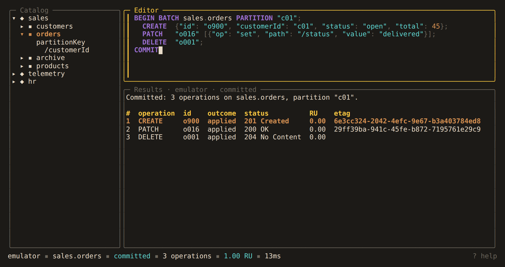

# 7. Transactional Batches

- [7.1. Writing a batch](#71-writing-a-batch)
- [7.2. Review and commit](#72-review-and-commit)
- [7.3. Outcomes](#73-outcomes)

Cosmos DB commits a group of item operations on one container and one logical
partition key as a whole or not at all: a transactional batch. Write one in the editor
and run it with `ctrl+r`.

## 7.1. Writing a batch

```sql
BEGIN BATCH sales.orders PARTITION "c01";
  CREATE  {"id": "o900", "customerId": "c01", "status": "open", "total": 45};
  REPLACE "o004" {"id": "o004", "customerId": "c01", "status": "shipped"}
          IF MATCH "\"0800-7f3a\"";
  PATCH   "o007" [{"op": "set", "path": "/status", "value": "cancelled"}];
  DELETE  "o003";
  READ    "o011";
COMMIT
```

- `BEGIN BATCH` always names `<database>.<container>`; the catalog's selection is never
  a batch's target. `PARTITION` takes one value per key path, in order: a hierarchical
  key names every one (`PARTITION "tenant-a", "eu", 42`).
- The operations are `CREATE body`, `UPSERT body`, `REPLACE "id" body`, `DELETE "id"`,
  `READ "id"` and `PATCH "id" [entries] [WHERE "condition"]`. `UPSERT`, `REPLACE`,
  `DELETE` and `PATCH` take `IF MATCH "etag"`; `CREATE` and `READ` refuse it, since the
  service would ignore it. A patch is the service's own array of `{"op", "path",
  "value"}` entries; `move` and a fractional `incr` cannot be sent by the Go SDK.
- Without its `COMMIT` a batch does not parse, so a half-typed one never runs. A buffer
  holds one batch or one query, never two batches: the service cannot commit two
  atomically, and Alchemist will not pretend to.
- The service takes at most 100 operations and 2 MB per batch. Every check that can be
  made before sending is made, and every problem is listed at once: the operation
  count, the size, a body without an `id` or in another partition, a replace whose
  body names another item, a patch of the `id` or the key, two creates of one `id`.

The full grammar is in the [statement reference](../reference/statements.md#begin-batch).

## 7.2. Review and commit

A batch that writes opens a review first, every time, recalled from history or not: the
account, the container, the key, each operation, and a warning for a write with no
`IF MATCH` or two operations on one item. It commits only once the container's name
is typed back exactly and `enter` pressed; `esc` sends nothing and records nothing. A
batch that only reads runs straight away.



`ctrl+b` on a row of a `SELECT *` query of one container, or in its detail, adds a
`REPLACE` of that document, conditional on its current ETag, to the batch in the
editor, or starts one when the editor holds a query.

A [read-only account](../data/profiles.md#104-read-only-accounts) refuses every batch
that writes, and `ctrl+b` drafts nothing there.

## 7.3. Outcomes

The outcome is a result set, one row per operation, which the detail view and export
treat like any other. It is one of four, and the status bar says which:



- **committed**: every operation applied.
- **rolled back**: an operation failed and nothing was written; the failed one is
  marked, and every other reads `424 Failed Dependency`.
- **not applied**: the request never left, or the service refused it whole (a throttled
  batch included). Nothing was written, and `ctrl+r` tries again.
- **outcome unknown**: the batch was sent and no answer came back, from a timeout, a
  dropped connection or a 5xx. It committed in full or not at all. Alchemist never
  retries a batch, and shows a query over the batch's partition to check before
  running it again.

A batch waits at most 30 seconds for its answer. Until it arrives `ctrl+r`, `ctrl+g`
and `q` wait too; `ctrl+c` still quits. There is no undo.

---

[← 6. Querying Across Containers](cross-container.md) · [Contents](../README.md) · [8. Updating by Query →](update.md)
