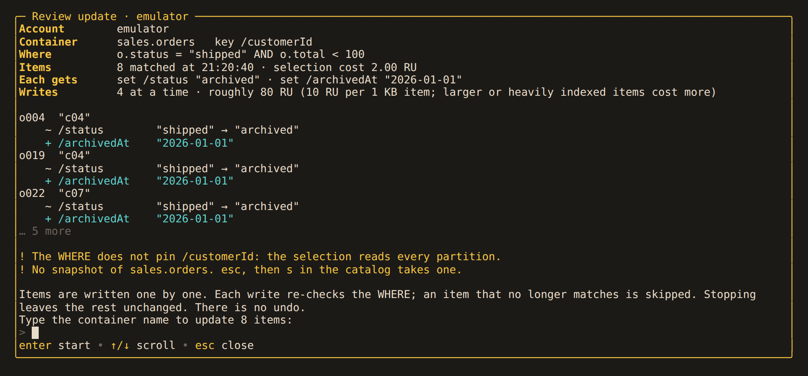
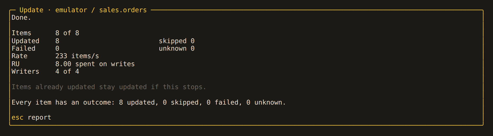
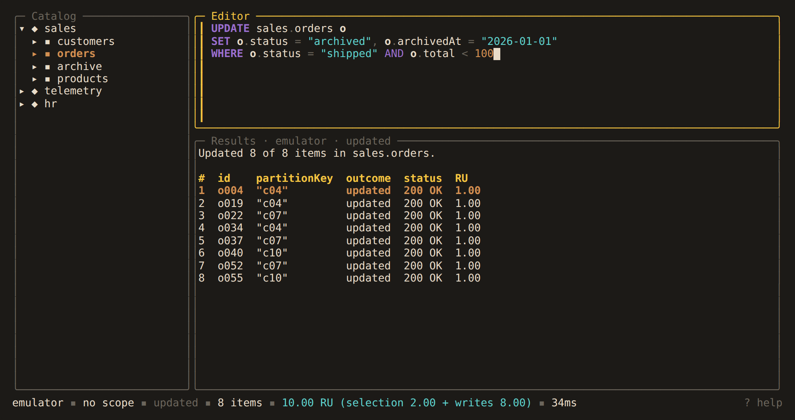

# Updating by query

Cosmos DB SQL cannot write. Alchemist runs an `UPDATE` in two steps: a query finds the
matching items, then each item gets a patch.

```sql
UPDATE sales.orders o
SET o.status = "archived", o.archivedAt = "2026-01-01"
WHERE o.status = "shipped" AND o.total < 50
```

## Syntax

- The target is `database.container`. Every path starts with the alias (`c` if none is
  given): `o.status`, `o.shipTo.region`, `o["order-id"]`, `o.lines[0].qty`.
- `SET path = value` sets a field and creates it if missing. The value must be a
  literal: a string, number, `true`, `false`, `null`, or JSON.
- `UNSET path` removes a field.
- A patch cannot create a missing parent object. An item without `shipTo` is skipped
  by `SET o.shipTo.region`.
- `WHERE` is required. Write `WHERE true` to update every item. The condition is sent
  to the service as written.

These are refused, with the reason:

- expressions or other fields on the right of `=`
- `+=` and increments, which are unsafe to repeat
- `SET o =`, array appends and moves
- `id`, partition key paths and system fields
- overlapping paths, and more than 10 operations
- a second container anywhere in the statement
- `TOP`, `ORDER BY`, `OFFSET`, `LIMIT`, `RETURNING`, and anything after `;`

## Review

`ctrl+r` does not write. It checks the statement, finds the matching items, and opens
a review:



The review shows the item count, the selection cost, a before and after for a few
items, an estimated write cost, and warnings. It warns when the `WHERE` does not
filter on the partition key and when it is `WHERE true`, and says whether the
container has a snapshot.

To start, type the container name. For `WHERE true`, type the name and the item count
(`orders 60`). A statement from history or a saved query is always reviewed again.

The update is refused if more than `max_mutation_items` items match (10,000 by
default). Read-only accounts refuse it before reading anything.

## How it runs

- Each item is written separately. A stopped or failed run leaves some items updated,
  and there is no rollback. The report lists which items were updated.
- Each patch carries the `WHERE` as its condition. An item that changed and no longer
  matches is `skipped: changed`. A deleted item is `skipped: gone`.
- A throttled write is retried after the delay the service asks for. A write with no
  response is marked `unknown` and not retried. The job stops after three unknowns in a
  row, 100 failures, or a rejected first write.
- Running the statement again is safe: `SET` to a literal and `UNSET` give the same
  result every time. This is also how you finish a stopped run.

Before a large update, take a [snapshot](../data/snapshots.md) or a
[clone](../data/cloning.md).

## Progress and report

The job runs in the background with up to four writes at a time (`writers` on the
profile). One background job runs at a time, shared with clones and snapshots.



| Key | Where | Action |
|---|---|---|
| `esc` | progress, running | hide |
| `w` | catalog | show again |
| `x` | progress, running | stop |
| `r` | progress, stopped | resume with the remaining items |
| `esc`, `enter` | progress, finished | show the report |

While it runs, the status bar shows `update prod/sales.orders 41% (w)`. You cannot
delete the container or disconnect its account. Batches into the container, clones,
snapshots and other updates wait. The first `q` shows the job; a second `q` stops it
and quits.

The report has one row per item with its outcome, status code and RU:



Outcomes are `updated`, `skipped: changed`, `skipped: gone`,
`skipped: no partition key`, `skipped: no parent`, `failed`, `unknown` and
`not attempted`. Above 10,000 items, the report lists items that were not updated
first.
