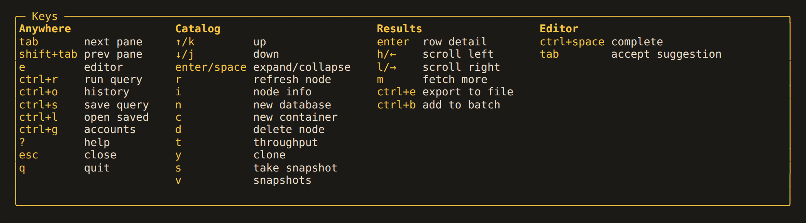

# Keys

`?` in the app lists these for the current pane. While the editor has focus, letters
are typed as text. `ctrl+c` always quits.

## Anywhere

| Key | Where | Action |
|---|---|---|
| `tab` / `shift+tab` | anywhere | next pane / prev pane |
| `e` | anywhere | editor |
| `ctrl+r` | anywhere | run query |
| `ctrl+o` | anywhere | history |
| `ctrl+s` | anywhere, history | save query |
| `ctrl+l` | anywhere | open saved |
| `ctrl+g` | anywhere | accounts |
| `ctrl+t` | anywhere, the editor included | themes |
| `?` | anywhere | help |
| `esc` | anywhere | close |
| `q` | anywhere but a text field | quit |

## Catalog

| Key | Where | Action |
|---|---|---|
| `↑/k`, `↓/j` | catalog, results | up, down |
| `enter/space` | catalog | expand/collapse |
| `r` | catalog | refresh node |
| `n` | catalog | new database |
| `c` | catalog | new container |
| `d` | catalog | delete node |
| `t` | catalog | throughput |
| `i` | catalog | node info |
| `y` | catalog | clone; with a clone under way, show it |
| `s` | catalog, snapshots | take snapshot |
| `v` | catalog | snapshots; with a capture under way, show it |
| `w` | catalog, an update or delete under way | show update/delete job |

## Results

| Key | Where | Action |
|---|---|---|
| `enter` | results | row detail |
| `h/←`, `l/→` | results | scroll left, scroll right |
| `m` | results | fetch more |
| `ctrl+e` | results | export to file |
| `ctrl+b` | results, row detail | add to batch |

## Editor

| Key | Where | Action |
|---|---|---|
| `ctrl+space` | editor | complete |
| `tab` | editor, list open | accept suggestion |
| `↑/↓`, `esc` | editor, list open | choose, dismiss |

## Batch review

| Key | Where | Action |
|---|---|---|
| `enter` | batch review, name typed | commit |
| `↑/↓` | batch review | scroll |

## Update and delete

| Key | Where | Action |
|---|---|---|
| `enter` | update or delete review, confirmation typed | start |
| `↑/↓` | update or delete review | scroll |
| `esc` | update or delete progress, running | hide |
| `x` | update or delete progress, running | stop |
| `r` | update or delete progress, ended short | resume |
| `esc`, `enter` | update or delete progress, ended | report |

## Clone progress

| Key | Where | Action |
|---|---|---|
| `esc` | clone progress | hide; close once the clone has ended |
| `x` | clone progress, running | stop |
| `r` | clone progress, ended short | resume |
| `d` | clone progress, ended short | delete the partial target |

## Saved queries

| Key | Where | Action |
|---|---|---|
| `r` | saved queries | rename |
| `d`, then `y` | saved queries | delete |

## Snapshots and diffs

| Key | Where | Action |
|---|---|---|
| `space` | snapshots | mark |
| `enter` | snapshots | diff |
| `d`, then `enter` | snapshots | delete snapshot |
| `x` | snapshots, capturing | cancel capture |
| `enter` | snapshots, note prompt | take |
| `enter` | diff | fields |
| `tab` | diff | all/added/removed/modified |

## Theme picker

| Key | Where | Action |
|---|---|---|
| `↑/↓` | theme picker | choose; only the preview changes |
| `enter` | theme picker | use and save |
| `esc`, `ctrl+t` | theme picker | close without changing anything |

In the editor, `ctrl+t` opens the picker instead of the textarea's transpose characters.
See [themes](../using/themes.md).

## Account switcher

| Key | Action |
|---|---|
| `enter` | switch to the selected account, connecting it first if it is not connected |
| `a` | add account: the connect form, empty |
| `x` | disconnect the selected account |
| `/` | filter by name or endpoint |
| `esc` | clear the filter, or close |
