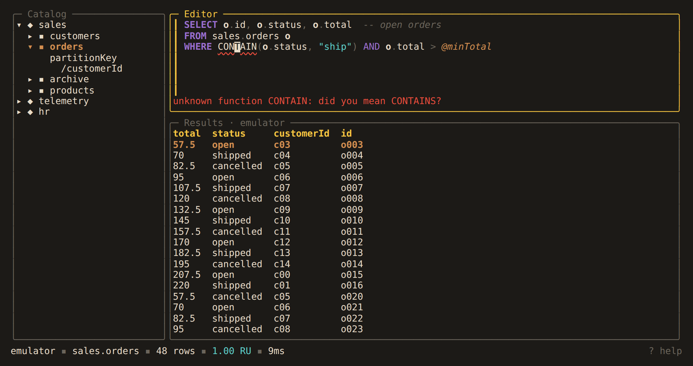
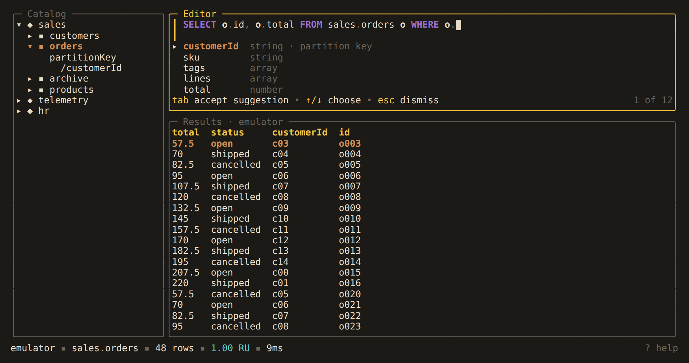

# Writing queries

## Error hints

The editor underlines mistakes it can find in the text. With the cursor on one, the
line under the editor says what is wrong:



| Mistake | Example | Hint |
|---|---|---|
| Unterminated string | `WHERE c.region = "west` | `unterminated string: close it with "` |
| Character Cosmos SQL does not use | `c.total # 5` | `"#" is not part of Cosmos SQL` |
| Unknown function | `CONTAIN(c.name, "A")` | `unknown function CONTAIN: did you mean CONTAINS?` |
| Undeclared alias | `SELECT o.id FROM c` | `o is not declared: the query reads c` |
| Misspelled clause | `SELECT * FORM c` | `FORM is not a clause: did you mean FROM?` |
| Misspelled `BY` | `ORDER BYY c.n` | `ORDER BYY needs BY: did you mean BY?` |
| Statement that does not start with `SELECT`, `UPDATE`, `DELETE` or `BEGIN BATCH` | `SELEC * FROM c` | `a statement starts with SELECT, UPDATE, DELETE or BEGIN BATCH` |
| Unbalanced bracket | `WHERE (c.a = 1` | `( is never closed` |
| Batch that does not parse | `BEGIN BATCH sales.orders PARTITION` | the parser's message |
| Update or delete that does not parse | `DELETE FROM sales.orders o` | the parser's message |

Suggestions are words within two edits of what you typed. An unknown function with no
close match is not flagged, since the service may have added it. Unknown fields,
databases and containers are never flagged.

Strings and stray characters are checked as you type. Everything else is checked when
you pause, and never in the word you are still typing. The service still has the
final say: a query with no hints can fail when it runs.

### Terminal support

Hints are drawn as a curly underline. kitty, WezTerm, iTerm2, Ghostty, foot, GNOME
Terminal and Windows Terminal support it. Other terminals show a plain underline or
none, and the hint line still explains the problem.

Set `diagnostics` on the [profile](../reference/configuration.md#profile-settings), or
pass `--diagnostics` for one session:

| Value | Effect |
|---|---|
| `curly` | curly underline (default) |
| `underline` | plain underline |
| `off` | no checking |

Use `underline` over SSH, or in an older terminal that does not draw curly underlines
correctly.

tmux passes curly underlines through with these lines in `.tmux.conf`:

```tmux
set -as terminal-overrides ',*:Smulx=\E[4::%p1%dm'
set -as terminal-overrides ',*:Setulc=\E[58::2::%p1%{65536}%/%d::%p1%{256}%/%{255}%&%d::%p1%{255}%&%d%;m'
```

## Autocomplete

A list of suggestions opens at the bottom of the editor as you type:



| After | Suggests |
|---|---|
| the start of a clause | keywords |
| an expression position | system functions, with signatures |
| `FROM`, `JOIN` or a comma in the `FROM` list | databases, and CTEs declared in `WITH` |
| `db.` | containers |
| `alias.` | fields, including nested paths |

Aliases resolve as the query runs them. In a [join](../language/cross-container.md),
each alias completes its own container's fields. `JOIN t IN c.tags` completes `t.`
from the array's elements, and `cte.` completes the columns the CTE selects. Clauses
the query cannot use are not suggested.

| Key | Action |
|---|---|
| `tab` | accept |
| `↑`/`↓` | choose |
| `esc` | dismiss until the next word |
| `ctrl+space` | open the list, even with nothing typed |

`enter` always inserts a newline. Keywords match the case you type (`sel` becomes
`select`). Field names are inserted as stored, in brackets when needed
(`c["order-id"]`).

### Field sampling

Cosmos DB has no schema, so field suggestions come from the partition key, the rows
your queries return, and a sample. The first time you complete a container's fields,
Alchemist runs `SELECT TOP 20 * FROM c` on it, once per session. This costs a few RU.
The hint line shows `sampling orders…` while it runs.

To turn sampling off, set `sample_fields = false` on the profile or pass
`--sample-fields=false`.
