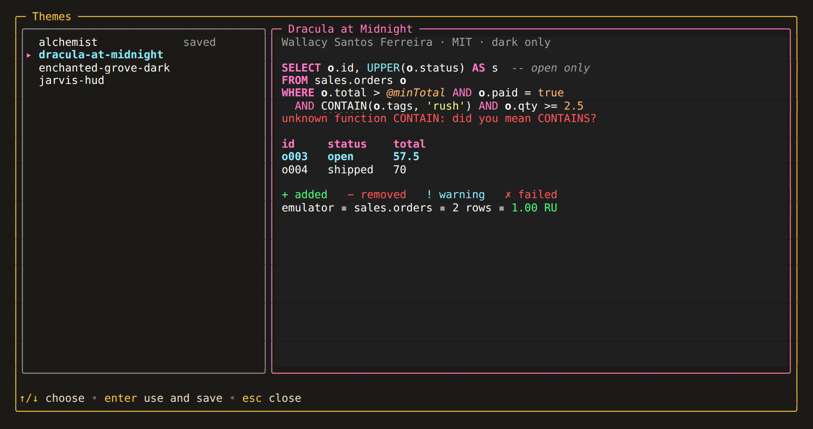
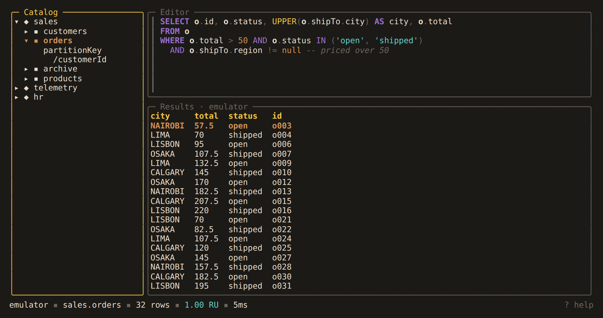
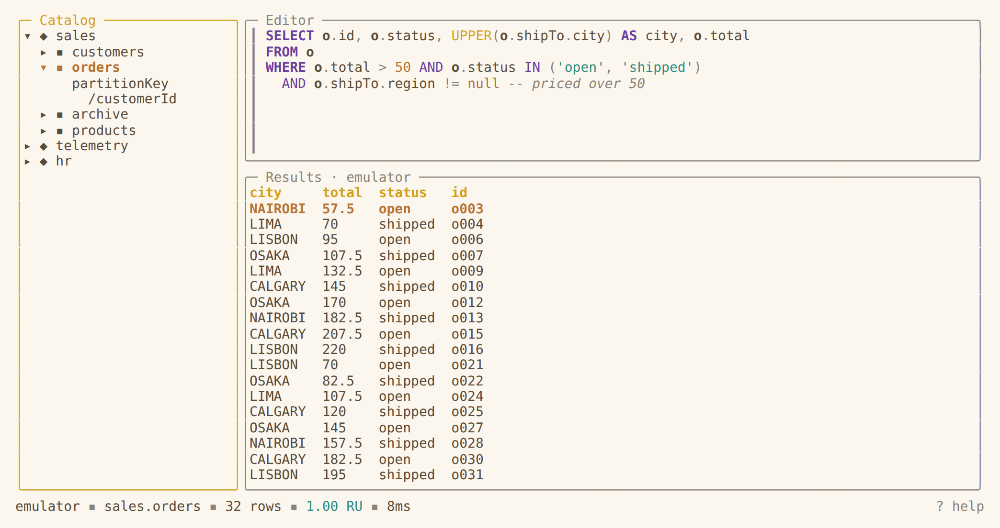
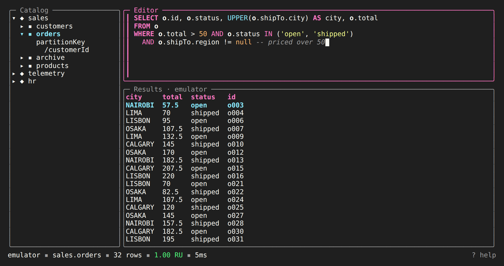
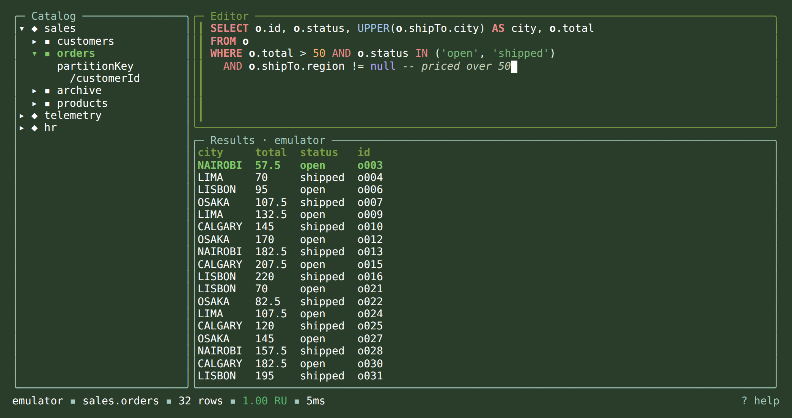
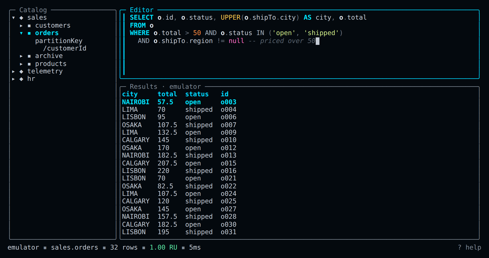

# Themes

A theme sets every color in Alchemist. `alchemist` is the default. Three more are built
in, and you can add your own. The theme you choose is saved, and every launch opens in
it until you choose another.

## Choosing a theme in the app

Press `ctrl+t` anywhere: in the catalog, in the results, or in the editor while you type.
The theme picker opens over the screen.



The list on the left holds the built-in themes, then your own. Marks after a name:

| Mark | Meaning |
|---|---|
| `saved` | the theme every launch opens in |
| `this session` | the theme in use now, when it is not the saved one |
| `cannot load` | a theme file with a problem; the line under the list says what it is |

The preview on the right draws the highlighted theme: a query with every kind of token
and an error hint, a results table, diff and outcome marks, and a status bar with its
request charge. Below 100 columns the preview moves under the list.

| Key | Action |
|---|---|
| `↑/↓` | choose; only the preview changes |
| `enter` | switch the whole screen to the theme now, and save it |
| `esc`, `ctrl+t` | close without changing anything |

Your query, its cursor and the focused pane are as you left them when the picker
closes. In the editor, `ctrl+t` opens the picker instead of transposing two
characters.

If the choice cannot be saved, for example because `config.toml` is read-only, the
theme stays in use for this session and the status bar says why it was not saved.

## Other ways to choose

| Way | Lasts |
|---|---|
| `ctrl+t` in the app | every launch, until you choose another |
| `alchemist theme use <name>` | every launch, until you choose another |
| `--theme <name>` | this launch only; the saved theme is untouched |
| `theme = "<name>"` in `config.toml` | every launch; the picker and `theme use` write it |

The picker and `alchemist theme use` save the theme the same way. A launch uses the
first of these that is set:

| Order | Source | When the theme does not load |
|---|---|---|
| 1 | `--theme <name>` | Alchemist refuses to start and lists the themes there are |
| 2 | `theme` in `config.toml` | Alchemist opens in `alchemist` and says why in the status bar and the log |
| 3 | nothing set | `alchemist` |

`alchemist theme use` refuses a theme that does not load, lists the themes there are,
and leaves `config.toml` as it was. To go back to the default, choose `alchemist`.

```sh
alchemist theme list
alchemist theme use dracula-at-midnight
alchemist --theme jarvis-hud
```

The theme is one setting for the whole session, not one per profile. Adding, changing
or removing a profile keeps it.

## Built-in themes

| Name | Based on | Author | License | Light and dark | Source background |
|---|---|---|---|---|---|
| `alchemist` | | Alchemist | MIT | adapts to both | none |
| `dracula-at-midnight` | Dracula At Midnight 3.0.0 | Wallacy Santos Ferreira, after Dracula Theme | MIT | dark only | `#1f1f1f` |
| `enchanted-grove-dark` | Enchanted Grove Dark, M Tech Themes 0.14.7 | M Tech | MIT | dark only | `#2A3D2B` |
| `jarvis-hud` | JARVIS HUD | Mohammad Areeb Ahmad | MIT | dark only | `#04090e` |

The three adapted themes come from dark VS Code themes. They give each role one color
for light and dark terminals, and read best on a dark one.

### Alchemist

The default theme. Its colors adapt to light and dark terminals.





| Role | Light terminal | Dark terminal |
|---|---|---|
| `text` | `#5C4B37` | `#E8DCC8` |
| `muted` | `#8A8378` | `#6B655B` |
| `accent` | `#D4A017` | `#F5C542` |
| `selected` | `#B87333` | `#D48F52` |
| `success` | `#2E8B84` | `#5FD3CE` |
| `warning` | `#D4A017` | `#F5C542` |
| `error` | `#C0392B` | `#E74C3C` |
| `keyword`, `operator` | `#6C3FA0` | `#9B6FD0` |
| `literal`, `parameter`, `number` | `#B87333` | `#D48F52` |
| `function` | `#D4A017` | `#F5C542` |
| `alias` | `#5C4B37` | `#E8DCC8` |
| `string` | `#2E8B84` | `#5FD3CE` |
| `comment`, `punctuation` | `#8A8378` | `#6B655B` |

### Dracula at Midnight



### Enchanted Grove Dark



### JARVIS HUD



### The editor

Every theme colors the editor's tokens by role. Emphasis belongs to the token, not the
theme: keywords and aliases are always bold, and parameters and comments italic.

| Token | Examples | Role |
|---|---|---|
| Clause keyword | `SELECT`, `FROM`, `WHERE`, `ORDER BY`, `JOIN`, `VALUE` | `keyword`, bold |
| Operator word | `AND`, `OR`, `NOT`, `IN`, `LIKE`, `BETWEEN`, `EXISTS` | `operator` |
| Literal | `true`, `null`, `undefined` | `literal` |
| Function | `STARTSWITH(`, `COUNT(`, `udf.discount(` | `function` |
| Alias | the `c` in `FROM c` and `c.total` | `alias`, bold |
| Parameter | `@minTotal` | `parameter`, italic |
| String | `'west'` | `string` |
| Number | `1.5e3` | `number` |
| Comment | `-- note` | `comment`, italic |
| Punctuation | `( ) , . = < + ??` | `punctuation` |

Property names are drawn in `text`. Batches, updates and deletes color their own
keywords (`BEGIN BATCH`, `PARTITION`, `COMMIT`, `UPDATE`, `SET`, `UNSET`, `DELETE`) as
clause keywords. Error hints are underlined in the `error` role.

## Backgrounds

Alchemist paints no background. The screen keeps your terminal's own background,
transparency and padding. For the look a theme was made for, set your terminal's
background to the theme's source background in the table above. The picker's preview
paints that background behind its samples.

## Writing your own theme

A theme is a TOML file in the `themes` folder beside `config.toml`:
`~/.config/alchemist/themes/<name>.toml`, or `$XDG_CONFIG_HOME/alchemist/themes/`. The
file name is the theme's name. It may use letters, digits, `-` and `_`, and may not be
the name of a built-in theme. Other files in the folder are ignored.

Start from a copy of a built-in theme:

```sh
mkdir -p ~/.config/alchemist/themes
alchemist theme show alchemist > ~/.config/alchemist/themes/mine.toml
```

This is the whole of `alchemist.toml`:

```toml
# Alchemist's default theme. Its colors adapt to light and dark terminals.
# To start your own theme from it:
#   alchemist theme show alchemist > ~/.config/alchemist/themes/mine.toml

[about]
title = "Alchemist"
source = "https://github.com/colbytimm/Alchemist"
license = "MIT"

[colors]
text = { light = "#5C4B37", dark = "#E8DCC8" } # parchment
muted = { light = "#8A8378", dark = "#6B655B" } # ash
accent = { light = "#D4A017", dark = "#F5C542" } # gold
selected = { light = "#B87333", dark = "#D48F52" } # copper
success = { light = "#2E8B84", dark = "#5FD3CE" } # verdigris
warning = { light = "#D4A017", dark = "#F5C542" } # gold
error = { light = "#C0392B", dark = "#E74C3C" } # cinnabar
keyword = { light = "#6C3FA0", dark = "#9B6FD0" } # amethyst
operator = { light = "#6C3FA0", dark = "#9B6FD0" } # amethyst
literal = { light = "#B87333", dark = "#D48F52" } # copper
function = { light = "#D4A017", dark = "#F5C542" } # gold
alias = { light = "#5C4B37", dark = "#E8DCC8" } # parchment
parameter = { light = "#B87333", dark = "#D48F52" } # copper
string = { light = "#2E8B84", dark = "#5FD3CE" } # verdigris
number = { light = "#B87333", dark = "#D48F52" } # copper
comment = { light = "#8A8378", dark = "#6B655B" } # ash
punctuation = { light = "#8A8378", dark = "#6B655B" } # ash
```

`[colors]` must set every role:

| Role | Where it shows |
|---|---|
| `text` | body text, form labels, property names in the editor |
| `muted` | hints, unfocused borders, the prompt of an unfocused editor |
| `accent` | focused borders, the spinner, the focused editor's prompt, keys in help, table headers (bold) |
| `selected` | the selected row in every list (bold) |
| `success` | success messages, added lines in diffs, the request charge |
| `warning` | warnings in reviews and progress views |
| `error` | errors, removed lines in diffs, the error hint underline |
| `keyword` | clause and batch keywords (bold) |
| `operator` | operator words |
| `literal` | `true`, `null`, `undefined` |
| `function` | built-in and user-defined functions |
| `alias` | aliases (bold) |
| `parameter` | `@name` parameters (italic) |
| `string` | strings |
| `number` | numbers |
| `comment` | comments (italic) |
| `punctuation` | brackets, commas and operator symbols |

A role takes one of two values:

| Value | Meaning |
|---|---|
| `"#RRGGBB"` | one color on light and dark terminals |
| `{ light = "#RRGGBB", dark = "#RRGGBB" }` | a color for each |

Colors are six hex digits. Alpha channels, three-digit colors and color names are
refused.

`[about]` is optional. `title`, `author`, `source` and `license` show in the picker and
in `alchemist theme list`. `background` records the color the theme was designed on;
only the picker's preview paints it.

The picker reads the folder each time it opens, so a new or changed file shows up the
next time you press `ctrl+t`, with no restart.

## When a theme does not load

Every problem names the theme and its file, then what is wrong:

| Problem | Message after `theme mine: ~/.config/alchemist/themes/mine.toml:` |
|---|---|
| TOML syntax | the parser's message and line, such as `toml: line 4: expected '=' ...` |
| unknown key | `unknown key "colors.keywords"` |
| missing roles | `missing roles: literal, alias` |
| not a color | `keyword: "#12345" is not #RRGGBB` |
| alpha channel | `keyword: "#EB396950" has an alpha channel a terminal cannot draw: use #RRGGBB` |
| half a pair | `keyword: a pair needs both light and dark` |
| built-in name | `jarvis-hud is a built-in theme: rename the file` |
| unreadable file | the operating system's error |

An unknown name reads `theme "x": unknown theme:` followed by the names there are.

Where the problem shows:

| Where | What you see |
|---|---|
| The picker | the theme is marked `cannot load`, the reason is under the list, and it cannot be chosen |
| The status bar at launch | for a saved theme, `theme mine not loaded: <problem>; using alchemist` |
| The log file | the full error |
| `alchemist theme list` | `cannot load:` and the problem, beside the theme's path |

Alchemist never clears a saved theme it cannot load. It opens in `alchemist` for that
launch and keeps the setting, so fixing or restoring the file brings your theme back
on the next launch.

## Turning colors off

Set `NO_COLOR` to turn off every color, whatever the theme. Error hints are then a
plain underline. The theme is still read, and a problem with it is still reported. The
picker still opens and saves a choice, and its preview says `colors are off
(NO_COLOR)`.

`--ascii` changes glyphs, not colors. It works with every theme, and the picker's marks
follow it.

## Credits

The adapted themes take only their colors from these VS Code themes. Each theme file
keeps its author's copyright and license notice, so `alchemist theme show` copies it
too. [THIRD_PARTY_NOTICES.md](../../THIRD_PARTY_NOTICES.md) has every license in full.

| Theme | Source | Author | License |
|---|---|---|---|
| `dracula-at-midnight` | [Dracula At Midnight](https://github.com/walcew/dracula-at-midnight) | Wallacy Santos Ferreira, after Dracula Theme | MIT |
| `enchanted-grove-dark` | [M Tech Themes](https://github.com/ChrisMcKee1/mtech-pro-vscode-themes) | M Tech | MIT |
| `jarvis-hud` | JARVIS HUD, read from the [vscodethemes.com mirror](https://github.com/AvinashReddy3108/CodemosModern-Themes-Registry) | Mohammad Areeb Ahmad | MIT |
